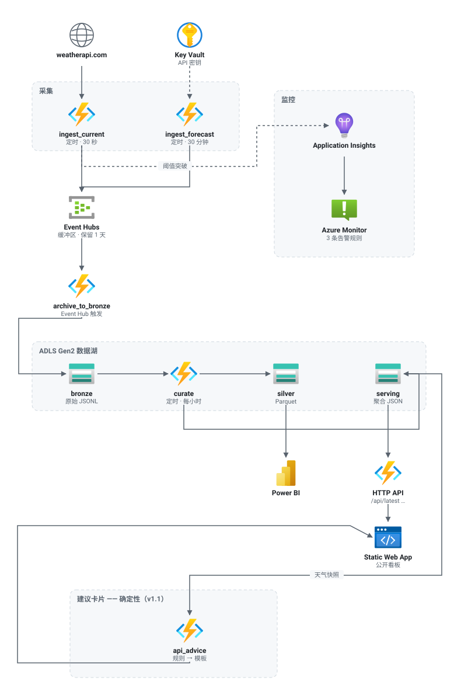

# Weather Streaming Pipeline · 天气流式采集与监控管道

*[English](README.md) · 简体中文*

一条跑在 Azure 上的无服务器采集与监控管道：每 30 秒采集一次遥测数据，经 Event Hubs 流入数据湖，
加工成可查询的表，最后呈现在一个公开看板上——**并且对管道本身和流经它的数据都做了告警**。

管道之上是一个**卡片式建议功能**，原型是同一个上云项目里规划过、但从未落地的 chatbot：
由天气条件触发，措辞取自检索到的官方安全指引，每一条建议都能追溯到它出自哪一段。
而它背后始终有一套确定性模板——检索或模型只要出任何问题，卡片就由模板来写。

| | |
| --- | --- |
| **技术栈** | Azure Functions（Python 3.12，Flex Consumption）· Event Hubs · ADLS Gen2 · Application Insights · Static Web Apps · Bicep |
| **本地运行** | `python scripts/serve_dashboard.py` —— 看板用仓库内的样本数据渲染，不需要 Azure 账号 |
| **线上部署** | 已暂停，见下 |

> **托管的部署目前是关闭的。** 同一订阅下的另一个项目——一个约 \$240/月的
> Azure AI Search Standard 实例——耗尽了额度，订阅转为只读。天气管道本身只占
> 这笔账单的约 2%。计费周期重置后会恢复，处置方案见
> [`docs/deployment.md`](docs/deployment.md)。
>
> 我宁可把这件事写出来，也不愿留一个点开是 404 的链接。真正去测这套东西的成本、
> 并且第一次测错了，反而是这个项目里比较有用的部分之一——最初 README 估的是
> 每月 \$12–14，实测是 \$44。

## 版本

三个版本，每一版都建立在前一版之上，所以 `git diff v1.0 v1.1` 就恰好是那一步的
完整故事，不掺任何别的东西。

| | 新增了什么 | 延伸阅读 |
| --- | --- | --- |
| **[v1.0](https://github.com/Shomao1998/weather-streaming-app/releases/tag/v1.0)** | 管道本身。30 秒轮询 → Event Hubs → medallion 数据湖 → 加工层 → 看板，跑在 Flex Consumption 上，全量 Bicep、OIDC 部署、三条告警规则。 | [`docs/architecture.md`](docs/architecture.md) |
| **[v1.1](https://github.com/Shomao1998/weather-streaming-app/releases/tag/v1.1)** | 确定性建议卡片。规则加模板——不用模型、不用检索。系统能说出的每一句话都是可审阅的固定字符串，`AdviceContentProvider` 就是 v1.2 接入的那道接缝。 | [`docs/advice.md`](https://github.com/Shomao1998/weather-streaming-app/blob/v1.1/docs/advice.md) |
| **[v1.2](https://github.com/Shomao1998/weather-streaming-app/releases/tag/v1.2)** | 检索式生成建议。模型根据当前天气事实加检索到的官方指引来写措辞，并且必须标出出处；任何一条失败路径都回落到 v1.1 卡片。 | [`docs/rag.md`](https://github.com/Shomao1998/weather-streaming-app/blob/v1.2/docs/rag.md) |

`main` 是 v1.0 加上这一页导航。后续每个版本都是一个 tag，并有对应的 `release/*`
分支；等订阅恢复到可部署状态后再合入 `main`。

---

## 这个项目为什么存在

我在咨询行业参与过一家大型金融机构的本地数据上云项目，其中一个需求是上云后如何存储内网
syslog。最初提议以 Azure 存储服务承载日志，并用 Application Insights 监控传输异常，
以满足**日志零丢失这一刚性要求**，以及至少保留两年的合规要求。该方案最终未能推进：
日志体量至少 TB 级，存储费用（**即便全部置于 Archive 层**）叠加 Application Insights
的监控费用，远超项目可负担的预算。

我在该项目中另负责跨团队任务进度追踪及看板呈现。参考其他开源的优秀作品集，
本项目将这两项需求合并为一套天气流式采集与监控看板。

同一个项目上还有第三个需求，我离开时它仍处在初期规划阶段，没有落地。上云之后员工要在一个
不熟悉的系统里工作，规划中的方案是一个**卡片式 chatbot**，用检索回答他们的问题，
知识来源是随系统更新的内部知识库与 FAQ——也就是说，被检索的文档本身每周都在变。
本项目的 v1.1 和 v1.2 就是这个想法的小型版：卡片由条件触发，措辞由检索到的官方指引生成，
每一条建议都能追溯到它出自哪一段。真正难的地方是一样的——源文档被替换或下架之后，
怎么让已经发出去的引用仍然可解析；以及当检索没返回任何有用内容时，系统该做什么。

**构建方式。** 需求、约束与验收标准由我定义，范围与成本决策由我做出；
实现部分通过与 AI 编码代理迭代产出。

**成本控制。** Application Insights 启用采样；默认日志级别设为 `Warning`
（`Information` 下 Azure SDK 会记录每一次 HTTP 请求）；各存储层均设有保留策略；
唯一高成本组件由配置开关控制启停。**技术上成立的设计，仍可能因运行成本而不可行。**

以天气数据替代日志，是因为两者共有三项特征：

- **上报频率高于内容变化频率。** 上游 API 每 10–15 分钟刷新一次，采集器每 30 秒运行一次，
  流中多为重复记录——等同于设备重复输出同一状态日志。
- **记录的重要性不均等。** 超过 38°C 的读数对应一行 `CRITICAL` 日志，需触发响应而非仅落盘。
- **数据缺失才是真正的故障。** 停止摄入的管道与正常管道在外部表现一致，
  除非有机制专门监测"无数据"状态。

## 架构

<p align="center">
  <picture>
    <source media="(prefers-color-scheme: dark)" srcset="docs/images/architecture-zh-dark.svg">
    
  </picture>
</p>

<sub>图源：<a href="scripts/render_architecture.py"><code>scripts/render_architecture.py</code></a>。产品图标为微软官方 Azure 架构图标，按其随附条款原样使用、未作变形；weatherapi.com 是第三方服务，因此用中性图形表示。</sub>

### 五个函数

| 函数 | 触发方式 | 职责 |
| --- | --- | --- |
| `ingest_current` | 定时，30 秒 | 采集当前天气和空气质量；判定阈值 |
| `ingest_forecast` | 定时，30 分钟 | 一次请求同时取回每日预报和活跃告警 |
| `archive_to_bronze` | Event Hub | 把流排空到分区化的原始 JSONL |
| `curate` | 定时，每小时 | bronze → silver Parquet 和服务层文档 |
| `health`、`api_*` | HTTP | 存活探针和看板的只读数据接口 |

### 存储布局

```
bronze/  current/date=2026-08-01/hour=14/20260801T143005-a1b2c3d4.jsonl   仅追加，从不改写
silver/  current/date=2026-08-01/current-20260801T150000.parquet          已去重，扁平列
serving/ latest.json · timeseries_24h.json · breaches_24h.json           小体积，预聚合
```

Hive 风格的分区（`date=`、`hour=`）在启用了分层命名空间的账号上就是真实目录，
所以 Power BI、Spark、Fabric、DuckDB 都能直接做分区裁剪，不需要额外配置。

## 设计决策

**在存储前置缓冲层，原始层只追加。** 采集写入 Event Hubs 而非直接写存储，bronze 层只追加、
从不改写。两者均源自零丢失要求：下游故障时数据先进缓冲区而非丢弃，已落地的记录不被覆写。

**按数据实际变化速度拆分采集。** 原来三个接口都是每 30 秒调一次。预报和天气告警一天才变几次，
用观测频率去轮询它们，等于把大约 90% 的 API 配额花在完全相同的字节上。
当前天气留在 30 秒的定时器上；预报和告警挪到 30 分钟，并且合并成一次请求。

**用确定性记录 ID 替代有状态去重。** 每条记录的 ID 是 `(位置, 上游观测时刻)` 的哈希。
轮询快于源刷新会产生完全相同的 ID，所以加工步骤用一个字典就能折叠重复——
采集器保持无状态，不需要状态存储，不需要水位表，也不要求流做到精确一次投递。
**这是零丢失要求下的取舍：丢失不可接受，重复只需在加工阶段折叠。**

**观测时间和摄入时间是两个独立字段。** 它们会分叉——正常情况下差一个轮询间隔，
故障恢复补数时差得多。把它们合成一列，事后就无法再推理迟到数据——
而在零丢失要求下，故障后重放补数是常态而非例外。

**用消费函数替代 Event Hubs Capture。** Capture 是把流落地到存储的托管方案，
但它按吞吐单元每小时计费，而且写的是 Avro。一个约 40 行的 Event Hub 触发函数，
在这个量级下成本几乎为零，写出的 JSONL 不用任何工具就能读——而且这段代码本身就是作品的一部分。
成本理由与当初否决原提案的一致：按量计费的托管服务在规模上放大得最快。

**数据湖永远不公开可读。** 直接从 Blob 存储给看板供数意味着要在账号级别打开匿名访问，
那样连原始的 bronze 数据也一起暴露了。所以改由 Function App 提供三个匿名只读接口，
带 30 秒的进程内缓存——这样一个开着的浏览器标签页不会变成"每次轮询一次存储事务乘以访客数"。

**用 Flex Consumption，不用经典的 Consumption 计划。** 这不是偏好：在 Visual Studio 订阅上，
`Y1` 和所有 App Service 层级都会在 preflight 阶段以 `SubscriptionIsOverQuotaForSku` 失败——
这些 SKU 消耗的 VM 配额是零。Flex Consumption 走的是另一套配额池。
它同时还有更快的冷启动，以及按实例内存而非 VM 数量的伸缩方式。

**用户分配的托管标识。** Flex Consumption 在首次启动时从 Blob 存储读取部署包，
而系统分配的标识授权不了这一步——因为它要等应用创建出来才存在。
先创建标识、先授予角色，就消除了这个顺序问题；副作用是配置里再也没有任何连接字符串或账号密钥。
Event Hubs、Storage 和 Key Vault 全部通过标识访问。

## 监控

三条告警规则，覆盖三种真正不同的失败模式：

| 告警 | 条件 | 为什么需要它 |
| --- | --- | --- |
| 无摄入 | 15 分钟内没有一次成功运行 | 停摆的管道从外部看是健康的 |
| 失败 | 15 分钟内失败调用超过 5 次 | 上游故障、密钥过期、部署损坏 |
| 阈值突破 | 最近 10 分钟出现 `critical` 读数 | 业务级告警——即一行 `CRITICAL` 日志 |

阈值突破以带自定义维度的结构化日志发出，Application Insights 收集它们，告警规则查询它们。
**日志即告警的传输通道，不需要引入额外服务。**

## 建议卡片（v1.1 · v1.2）

回应上面那第三个需求的卡片。它位于看板顶部，只在条件满足时才出现，且从不阻塞天气本身。

**这部分代码在 [v1.1](https://github.com/Shomao1998/weather-streaming-app/releases/tag/v1.1)
和 [v1.2](https://github.com/Shomao1998/weather-streaming-app/releases/tag/v1.2)
两个标签上，不在 `main` 上**——等订阅恢复到可部署状态后再合入。

### v1.1 —— 规则加模板，不用模型

| 触发器 | 触发条件 | 同时命中时的先后 |
| --- | --- | --- |
| `EXTREME_HEAT` | `temp_c >= 35` | 1 |
| `HIGH_WIND` | `wind_kph >= 40` | 2 |
| `HIGH_UV` | `uv >= 8` | 3 |
| `RAIN_EXPECTED` | 下一小时 `chance_of_rain >= 80` | 4 |

刻意不用模型、不用检索、不用向量库。系统能说出的每一句话都是一个人审阅过的字符串，
每一个决策都能在单测里复现。**把措辞放到最后做**，正是 v1.2 只需换一个类、
而不必重做整个功能的原因。

- **阈值是配置，不是代码。** 规则去读它，而不是把它写死。
- **去重是确定性的副产品，不是靠存状态。** 推荐 id 是
  `hash(地点 + 触发器 + 快照 id + 规则版本)`，所以同一次观测产生的同一条建议
  **字面上就是同一张卡片**——不需要任何东西记住"我展示过什么"。
- **观测时间和生成时间是两个独立字段。** 混为一谈，卡片就会暗示一种它并不具备的新鲜度。
- **严重度和优先级是两个概念。** 哪张卡片胜出，和它该显得多紧急，不是同一个问题。
- **风险等级上升会同时越过频控窗口和静音。** 抑制是一种体谅，不该压过一个正在恶化的
  危险；一个静音了 `WARNING` 的用户，并没有同意错过 `SEVERE`。
- **它安静地失败。** 建议是在天气渲染完之后才请求的；数据过期、卡片被抑制、
  provider 崩了、接口不可达——每一种都归结为不显示任何东西，而不是让页面变差。

### v1.2 —— 建议须有官方出处

措辞现在由模型产出，模型拿到当前天气事实，加上从一份经过审阅的官方安全指引语料中
检索到的段落，并且必须为每条建议标出出处段落。

**规则层没有动。** 是否出卡、属于哪种风险、严重度多少、何时抑制、何时过期，
全部仍由上面那套引擎决定。检索和生成严格位于其下游，只负责选词。

真正值得围绕它做设计的问题不是"模型能不能写天气建议"，而是
**怎么阻止一个错误答案到达用户**：

- **校验是确定性的，全程没有 LLM-as-a-judge。** 裁判模型可能和生成模型朝同一个方向
  出错；而一个 chunk id 要么在这次检索里出现过，要么没有。闸门会拒绝：不属于**本次**
  检索的引用、指向已下架来源的引用、19 个封闭编码之外的动作、以及既不在天气事实
  也不在被引段落中的任何数字。畸形输出直接拒绝，绝不修复。
- **兜底是彻底的。** 检索失败、超时、证据不足、JSON 畸形、校验不通过、伪造引用、
  模型弃答、未配置部署——每一种都返回 v1.1 的卡片。每一种在 eval 里都有一个用例，
  跑在被**故意弄坏**的依赖上，因为"它会兜底"是一个必须被执行的断言。
- **过滤是结构化的，不是文本层面的。** 触发器到危害类型是固定映射，用户的问题是
  **追加**在种子查询之后而非替换它——所以「别管高温了，跟我说说洪水」检索的仍然是
  高温语料。
- **语料由人工审阅准入，绝不靠爬取。** 六个登记来源，每个都带 authority、URL、
  司法辖区、许可、版本与核验日期；缺任何一项，摄取流程拒绝运行。

检索层是一个接口配两套实现：生产用 Azure AI Search，另一套本地索引跑同样的
BM25 + 向量 + RRF(K=60) 策略且零成本——正是它让检索层能在 CI 里真跑。
**Azure 那条路径代码写完了、能离线校验的部分有测试断言，但从未连过真实服务。**

53 个 eval 用例作为 CI 门禁：0 条无法解析的引用、0 次危害串档、0 次该兜底却没兜底。

完整设计见 **[docs/advice.md](https://github.com/Shomao1998/weather-streaming-app/blob/v1.1/docs/advice.md)**（v1.1）
与 **[docs/rag.md](https://github.com/Shomao1998/weather-streaming-app/blob/v1.2/docs/rag.md)**（v1.2）。

## 仓库结构

```
infra/main.bicep                  全部 Azure 资源，幂等，一条命令
src/functions/                    部署包 —— host.json 在其根目录
  function_app.py                 只做触发器注册
  weather/                        config · api · models · transform · monitoring
                                  clients · sinks · pipeline · serving
dashboard/                        三个文件，无框架，无外部请求
scripts/                          架构图渲染、本地看板服务、样本数据、OIDC 配置
tests/                            99 个测试
docs/architecture.md              更深的权衡、成本、被否掉的备选方案
docs/deployment.md                部署手册、首次部署清单、排障
powerbi/                          报表模板与连接说明
```

## 本地运行

下面这些都不需要 Azure 订阅。

```bash
python3.12 -m venv .venv && source .venv/bin/activate
pip install -r requirements-dev.txt
pytest
```

看板可以直接跑在提交进仓库的样本数据上：

```bash
python scripts/serve_dashboard.py   # http://127.0.0.1:4280
```

要让函数跑在真实 API 上，复制配置模板、填入 [weatherapi.com](https://www.weatherapi.com/) 的密钥，
然后启动 host：

```bash
cp src/functions/local.settings.json.example src/functions/local.settings.json
# 填 WEATHER_API_KEY；EVENT_HUB_ENABLED 保持 false，数据会直接写进 Azurite
cd src/functions && func start
```

## 部署

```bash
az deployment group create \
  --resource-group rg-weather-streaming \
  --template-file infra/main.bicep \
  --parameters infra/main.parameters.json
```

然后推送到 `main`，或手动运行 **Deploy** workflow。首次部署清单、Key Vault 密钥、
以及 CI 鉴权的配置方式见 [docs/deployment.md](docs/deployment.md)。

## 成本

我估的是每月 **12–14 美元**，实测约 **44 美元**——差了三倍。与其悄悄改掉，不如写下来。

| 资源 | 原估算 | 估错在哪 |
| --- | --- | --- |
| Event Hubs Basic | 约 $11 | 估对了。 |
| Function App（Flex Consumption） | 约 9 万次执行下 $1–2 | Flex **没有免费执行额度**。有免费额度的是 Consumption（Y1），我把那个假设直接搬了过来——可这个订阅的 VM 配额为 0，Y1 根本部署不了。 |
| 存储（ADLS Gen2 + 运行时） | < $1 | 大致正确。 |
| Log Analytics / App Insights | $0，在 5GB 免费额度内 | 实际**按摄入 GB 计费**，而一个 30 秒的定时器在 `Information` 级别下写入的量远超预期。把默认日志级别降到 `Warning`，既是降噪也是降本。 |
| Azure Monitor 告警规则 | 没算 | 每条规则每月约 $1，共三条。 |
| Static Web Apps | $0（Free 层） | 估对了。 |

上表是最初的估算；修正版要等订阅恢复、攒够一整周干净的账单数据后再出。这个教训可以外推：
让无服务器估算显得便宜的那些免费额度，是**绑定在特定 SKU 上的**——一旦平台约束逼你换 SKU，
它们会悄无声息地消失。

Event Hubs 是最大的单项开销，也是唯一严格可选的组件——sink 层是一个接口，
把 `EVENT_HUB_ENABLED` 设为 `false` 就让采集直接写入 bronze。

### 数据保留

**只增不减的存储，是日志平台受制于成本而非架构的主要原因。** 每一层的保留策略均写入
`infra/main.bicep`，而非留待运行时决定：

| 层 | 策略 |
| --- | --- |
| Event Hubs | 1 天——它是缓冲区不是存储，归档函数在持续排空它 |
| `bronze` | 30 天转 Cool → 90 天转 Archive → 730 天删除（对应两年的合规保留期） |
| `silver` | 90 天转 Cool；不归档、不删除，而且它随时可以从 bronze 重建 |
| `serving` | 始终 Hot——三个小文件，每小时重写、每次页面加载都会读 |
| Log Analytics | 30 天 |

**把 bronze 归档是安全的，恰恰因为下游不读它**：`curate` 永远只碰最近 24 小时的数据，
所以原始数据落地一天之内就已经是冷数据了。日后取回要等一次解冻——
对于「为了应付审计而不是为了查询」而保存的数据，这是正确的取舍。

## 局限

- Event Hubs Basic 只保留一天、只允许一个消费者组。这里够用，因为归档函数在持续排空它；
  但要再加一个独立消费者就需要 Standard 层。
- `curate` 每次运行都重新处理滚动的 24 小时，而不是记录水位。这个量级下比记账更便宜，
  放大 100 倍就不是了。
- silver 层是整天重写文件，而不是增量压实。
- Power BI 按自己的计划刷新，不是实时的；实时视图由网页看板负责。
  两者为什么分开，见 [powerbi/README.md](powerbi/README.md)。
