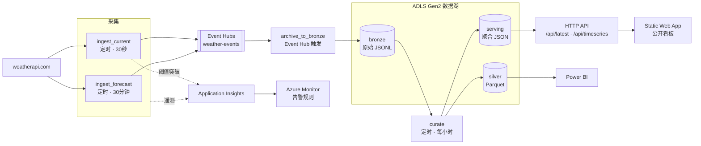

# Weather Streaming Pipeline · 天气流式采集与监控管道

*[English](README.md) · 简体中文*

一条跑在 Azure 上的无服务器采集与监控管道：每 30 秒采集一次遥测数据，经 Event Hubs 流入数据湖，
加工成可查询的表，最后呈现在一个公开看板上——**并且对管道本身和流经它的数据都做了告警**。

| | |
| --- | --- |
| **在线看板** | https://lively-pond-063e00c0f.7.azurestaticapps.net |
| **健康探针** | https://func-weather-e5lpvy.azurewebsites.net/health |
| **在线 API** | [`/api/latest`](https://func-weather-e5lpvy.azurewebsites.net/api/latest) · [`/api/timeseries`](https://func-weather-e5lpvy.azurewebsites.net/api/timeseries) · [`/api/breaches`](https://func-weather-e5lpvy.azurewebsites.net/api/breaches) |
| **技术栈** | Azure Functions（Python 3.12，Flex Consumption）· Event Hubs · ADLS Gen2 · Application Insights · Static Web Apps · Bicep |

---

## 这个项目为什么存在

我在咨询行业参与过一个大型金融机构的上云项目。其中一条工作线提议将本地 syslog 采集至
Azure 存储并告警，最终未被采纳：日志体量至少 TB 级、需保留两年，月请求量级无法确定
（数亿或数十亿），单个 App 服务能否承载难以判断，存储与 Application Insights 的费用
亦超出预算。我在该项目负责跨团队进度跟踪与看板维护。

本项目将两者合并，以公开天气 API 替代日志源。

**关于构建方式。** 需求、约束与验收标准由我定义，范围与成本决策由我做出；
实现部分通过与 AI 编码代理迭代产出。

上述经历决定了本项目对成本的处理方式：Application Insights 已启用采样，默认日志级别设为
`Warning`（在 `Information` 下，Azure SDK 会记录其发出的每一次 HTTP 请求），
每层存储均设有明确的保留策略，唯一昂贵的组件由一个配置开关控制启停。
**技术上成立的设计，仍可能因运行成本而不可行。**

用天气数据顶替日志是经过考虑的，不是随手找了个 API。天气读数和日志数据共享几个让人头疼的性质：

- **上报速度快于内容变化速度。** 上游 API 每 10–15 分钟才刷新一次，而采集器每 30 秒跑一次，
  所以流里大部分是重复数据——和一台设备反复吐出同一行状态日志是同一个问题。
- **少数记录比其他重要得多。** 一个越过 38°C 的温度读数，等价于一行 `CRITICAL` 日志：
  它必须触发点什么，而不只是落进存储。
- **真正的故障是"没有数据"。** 一条什么都没摄入的管道，从外部看和健康的管道一模一样，
  除非有东西专门盯着"沉默"这件事。

## 架构



### 五个函数

| 函数 | 触发方式 | 职责 |
| --- | --- | --- |
| `ingest_current` | 定时，30 秒 | 采集当前天气和空气质量；判定阈值 |
| `ingest_forecast` | 定时，30 分钟 | 一次请求同时取回每日预报和活跃告警 |
| `archive_to_bronze` | Event Hub | 把流排空到分区化的原始 JSONL |
| `curate` | 定时，每小时 | bronze → silver Parquet 和服务层文档 |
| `health`、`api_*` | HTTP | 存活探针和看板的只读数据接口 |

### 存储布局

```
bronze/  current/date=2026-08-01/hour=14/20260801T143005-a1b2c3d4.jsonl   仅追加，从不改写
silver/  current/date=2026-08-01/current-20260801T150000.parquet          已去重，扁平列
serving/ latest.json · timeseries_24h.json · breaches_24h.json           小体积，预聚合
```

Hive 风格的分区（`date=`、`hour=`）在启用了分层命名空间的账号上就是真实目录，
所以 Power BI、Spark、Fabric、DuckDB 都能直接做分区裁剪，不需要额外配置。

## 设计决策

**按数据实际变化速度拆分采集。** 原来三个接口都是每 30 秒调一次。预报和天气告警一天才变几次，
用观测频率去轮询它们，等于把大约 90% 的 API 配额花在完全相同的字节上。
当前天气留在 30 秒的定时器上；预报和告警挪到 30 分钟，并且合并成一次请求。

**用确定性记录 ID 替代有状态去重。** 每条记录的 ID 是 `(位置, 上游观测时刻)` 的哈希。
轮询快于源刷新会产生完全相同的 ID，所以加工步骤用一个字典就能折叠重复——
采集器保持无状态，不需要状态存储，不需要水位表，也不要求流做到精确一次投递。

**观测时间和摄入时间是两个独立字段。** 它们会分叉——正常情况下差一个轮询间隔，
故障恢复补数时差得多。把它们合成一列，事后就没法再推理迟到数据了。

**用消费函数替代 Event Hubs Capture。** Capture 是把流落地到存储的托管方案，
但它按吞吐单元每小时计费，而且写的是 Avro。一个约 40 行的 Event Hub 触发函数，
在这个量级下成本几乎为零，写出的 JSONL 不用任何工具就能读——而且这段代码本身就是作品的一部分。

**数据湖永远不公开可读。** 直接从 Blob 存储给看板供数意味着要在账号级别打开匿名访问，
那样连原始的 bronze 数据也一起暴露了。所以改由 Function App 提供三个匿名只读接口，
带 30 秒的进程内缓存——这样一个开着的浏览器标签页不会变成"每次轮询一次存储事务乘以访客数"。

**用 Flex Consumption，不用经典的 Consumption 计划。** 这不是偏好：在 Visual Studio 订阅上，
`Y1` 和所有 App Service 层级都会在 preflight 阶段以 `SubscriptionIsOverQuotaForSku` 失败——
这些 SKU 消耗的 VM 配额是零。Flex Consumption 走的是另一套配额池。
它同时还有更快的冷启动，以及按实例内存而非 VM 数量的伸缩方式。

**用户分配的托管标识。** Flex Consumption 在首次启动时从 Blob 存储读取部署包，
而系统分配的标识授权不了这一步——因为它要等应用创建出来才存在。
先创建标识、先授予角色，就消除了这个顺序问题；副作用是配置里再也没有任何连接字符串或账号密钥。
Event Hubs、Storage 和 Key Vault 全部通过标识访问。

## 监控

三条告警规则，覆盖三种真正不同的失败模式：

| 告警 | 条件 | 为什么需要它 |
| --- | --- | --- |
| 无摄入 | 15 分钟内没有一次成功运行 | 停摆的管道从外部看是健康的 |
| 失败 | 15 分钟内失败调用超过 5 次 | 上游故障、密钥过期、部署损坏 |
| 阈值突破 | 最近 10 分钟出现 `critical` 读数 | 业务级告警——即一行 `CRITICAL` 日志 |

阈值突破以带自定义维度的结构化日志发出，Application Insights 收集它们，告警规则查询它们。
**日志即告警的传输通道，不需要引入额外服务。**

## 仓库结构

```
infra/main.bicep                  全部 Azure 资源，幂等，一条命令
src/functions/                    部署包 —— host.json 在其根目录
  function_app.py                 只做触发器注册
  weather/                        config · api · models · transform · monitoring
                                  clients · sinks · pipeline · serving
dashboard/                        三个文件，无框架，无外部请求
scripts/                          本地看板服务、样本数据生成、OIDC 配置
tests/                            99 个测试
docs/architecture.md              更深的权衡、成本、被否掉的备选方案
docs/deployment.md                部署手册、首次部署清单、排障
powerbi/                          报表模板与连接说明
```

## 本地运行

下面这些都不需要 Azure 订阅。

```bash
python3.12 -m venv .venv && source .venv/bin/activate
pip install -r requirements-dev.txt
pytest
```

看板可以直接跑在提交进仓库的样本数据上：

```bash
python scripts/serve_dashboard.py   # http://127.0.0.1:4280
```

要让函数跑在真实 API 上，复制配置模板、填入 [weatherapi.com](https://www.weatherapi.com/) 的密钥，
然后启动 host：

```bash
cp src/functions/local.settings.json.example src/functions/local.settings.json
# 填 WEATHER_API_KEY；EVENT_HUB_ENABLED 保持 false，数据会直接写进 Azurite
cd src/functions && func start
```

## 部署

```bash
az deployment group create \
  --resource-group rg-weather-streaming \
  --template-file infra/main.bicep \
  --parameters infra/main.parameters.json
```

然后推送到 `main`，或手动运行 **Deploy** workflow。首次部署清单、Key Vault 密钥、
以及 CI 鉴权的配置方式见 [docs/deployment.md](docs/deployment.md)。

## 成本

每月约 **12–14 美元**，其中一项占了绝大部分：

| 资源 | 每月 |
| --- | --- |
| Event Hubs Basic | 约 $11 |
| Function App（Flex Consumption） | 约 9 万次执行下 $1–2 |
| 存储（ADLS Gen2 + 运行时） | < $1 |
| Log Analytics / App Insights | $0，在 5GB 免费额度内 |
| Static Web Apps | $0（Free 层） |

Event Hubs 是唯一有意义的开销，也是唯一严格可选的组件——sink 层是一个接口，
把 `EVENT_HUB_ENABLED` 设为 `false` 就让采集直接写入 bronze。

### 数据保留

**只增不减的存储，是日志平台受制于成本而非架构的主要原因。** 每一层的保留策略均写入
`infra/main.bicep`，而非留待运行时决定：

| 层 | 策略 |
| --- | --- |
| Event Hubs | 1 天——它是缓冲区不是存储，归档函数在持续排空它 |
| `bronze` | 30 天转 Cool → 90 天转 Archive → 730 天删除（对应两年的合规保留期） |
| `silver` | 90 天转 Cool；不归档、不删除，而且它随时可以从 bronze 重建 |
| `serving` | 始终 Hot——三个小文件，每小时重写、每次页面加载都会读 |
| Log Analytics | 30 天 |

**把 bronze 归档是安全的，恰恰因为下游不读它**：`curate` 永远只碰最近 24 小时的数据，
所以原始数据落地一天之内就已经是冷数据了。日后取回要等一次解冻——
对于「为了应付审计而不是为了查询」而保存的数据，这是正确的取舍。

## 局限

- Event Hubs Basic 只保留一天、只允许一个消费者组。这里够用，因为归档函数在持续排空它；
  但要再加一个独立消费者就需要 Standard 层。
- `curate` 每次运行都重新处理滚动的 24 小时，而不是记录水位。这个量级下比记账更便宜，
  放大 100 倍就不是了。
- silver 层是整天重写文件，而不是增量压实。
- Power BI 按自己的计划刷新，不是实时的；实时视图由网页看板负责。
  两者为什么分开，见 [powerbi/README.md](powerbi/README.md)。
